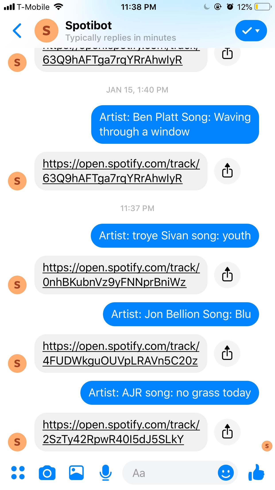

 

Screenshot of Spotibot in use

  
## Motivation

I like to listen to a lot of music and often want to share these songs with my friends. I found it extremely inconvenient to switch back and forth between the Spotify app and the Messenger app, so I decided to make a messenger app that would retrieve a shareable link for me. 

## How I coded this project

The first resource I turned to was this <a href="https://www.youtube.com/watch?v=uU4pjtcbFeg&list=PLyb_C2HpOQSC4M3lzzrql7DSppTeAxh-x">Facebook Messenger Bot Tutorial </a> by the Indian Pythonista. After I completed a simple echo chatbot, I created a Spotify Developer Account and started using the Spotify API to retreive songs. I parsed the JSON data to first find the artist, and then searched the artist's albums until I found the track that matched the user's request. 

## Github Link 

