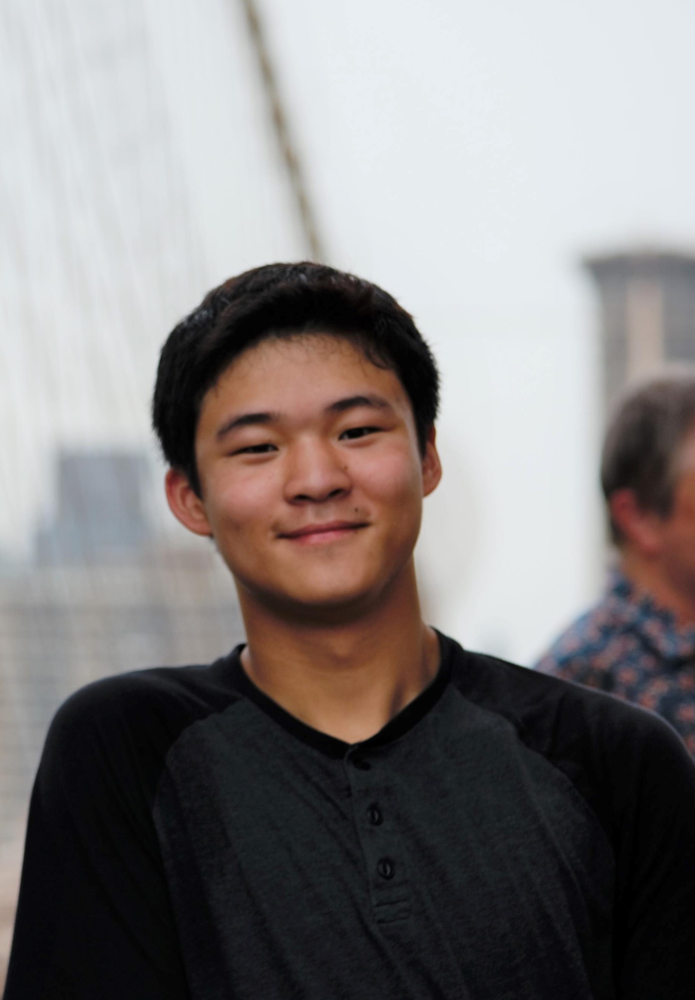
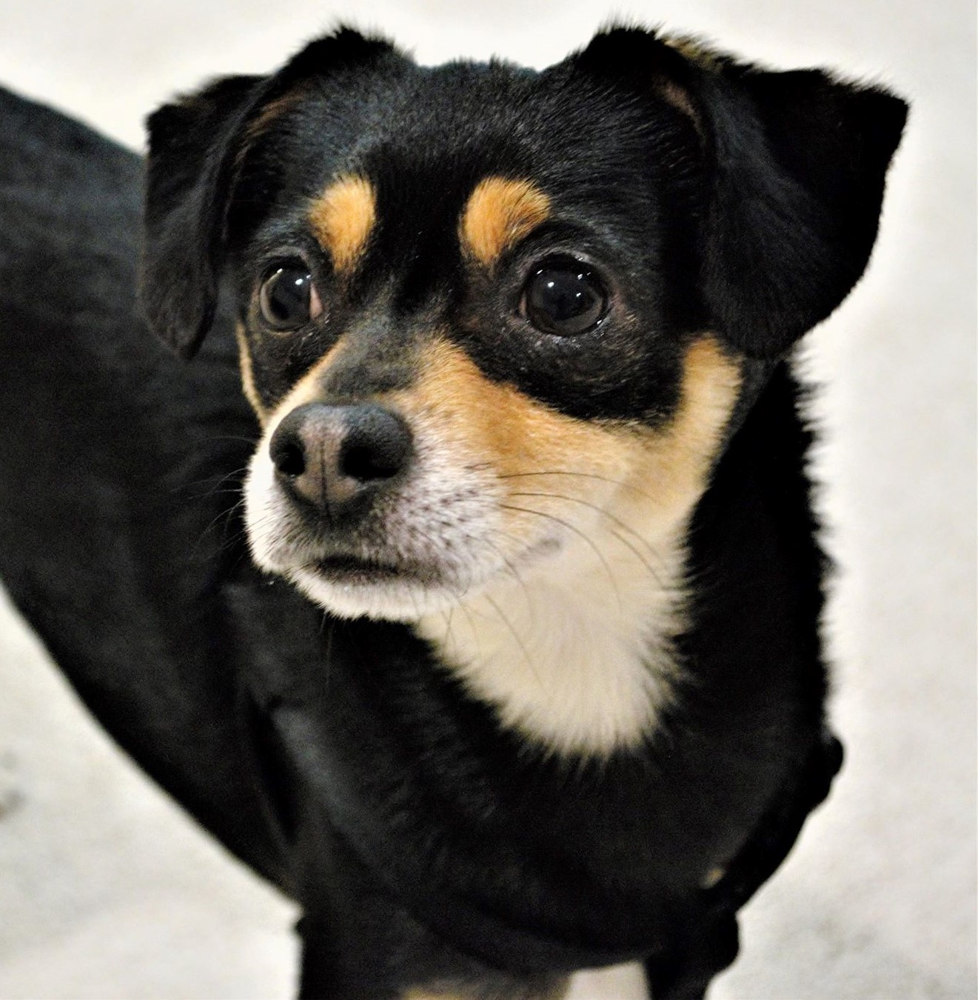

    
## Who I am

Hi there! I am currently a third-year CSE undergrad at the UW. I used to help teach the introductory programming courses as a TA and worked as a research assistant for the ConCodeIt! team at the <a href='https://hcrlab.cs.washington.edu/'>Human-Centered Robotics Lab</a>. In the summer, I will be working at Microsoft on the Azure Product Infrastructure Engineering (PIE) team.

Outside of School, I'm a casual <a href="https://www.goodreads.com/user/show/67088130-mino-nakura">book reader</a> and Sounders/Man. United fan. I also have a dog named Kohaku.

<table><tr>
<td>  </td>
<td>  </td>
</tr></table>
