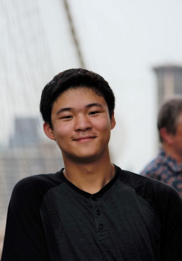

    
## Who I am

My name is Mino (It's pronounced like Nemo, but with the N and M switched). I'm a second-year CSE student at the UW
and am currently a Teaching Assistant for CSE 142. I honestly don't know what I love about CS, but I do know that 
I love solving problems and enjoy the challenges that CSE provides. 

Outside of School, I'm a casual <a href="https://www.goodreads.com/user/show/67088130-mino-nakura">book reader</a>, 
<a href="https://myanimelist.net/profile/cra_a_azy">anime viewer</a>, and dedicated soccer fan. I also have a dog
named Kohaku (and I'm very proud of him)!

## My Face.


    {:class="img-responsive"}
    {:class="img-responsive"}


